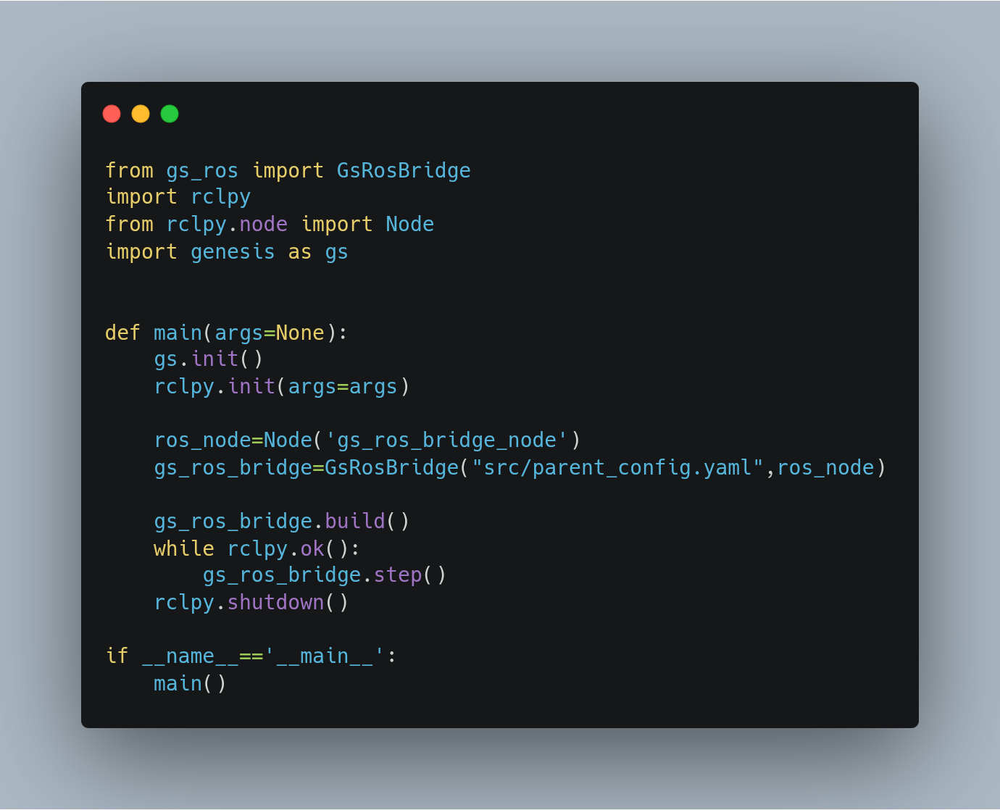

# Genesis ROS Bridge (gs_ros) 🤖

`gs_ros` is a ROS 2 package designed to bridge the gap between the powerful [Genesis](https://github.com/Genesis-Embodied-AI/Genesis.git) simulator and the ROS 2 ecosystem. Genesis is a next-generation physics platform for Robotics and Embodied AI, offering:

1.  A universal physics engine built from the ground up for a wide range of materials.
2.  A lightweight, ultra-fast, and user-friendly robotics simulation platform.
3.  A powerful and fast photo-realistic rendering system.
4.  A generative data engine that can create multi-modal data from natural language prompts.

This project provides the essential tools to kickstart your robotics development and simulation within ROS 2 using Genesis. Using this package is very simple, the main code is 5 lines long 


---

## ✨ Key Features

`gs_ros` is a lightweight, pure Python package that simplifies the integration of Genesis and ROS 2.

-   **ROS 2 Control Integration**: Leverages `topic_based_ros2_control` from PickNikRobotics for seamless compatibility with the `ros2_control` framework.
-   **Simulator Services**: Exposes core simulator functionalities (like pausing, resetting,domain_randomisation,inverse kinematics, forward kinematics, path planning) through ROS 2 services, defined in the accompanying `gs_ros_interfaces` package.
-   **Comprehensive Sensor Suite**: Provides a variety of simulated sensors, publishing data on standard ROS 2 topics.

---

## 🎮 Supported Sensors

`gs_ros` provides out-of-the-box support for several common robotics sensors:

-   📷 **Camera**: Publishes RGB, depth, semantic segmentation, and surface normal images.
-   📸 **RGBD Camera**: A convenient wrapper for synchronized RGB and depth image publishing.
-   🛰️ **IMU**: Simulates an Inertial Measurement Unit.
-   📏 **Sectional Lidar**: A ray based lidar covering a section of the space(analogus to a depth camera).
-   🌐 **3D Lidar**: A ray based 360 degree 3D Lidar.
-   📡 **LaserScan** A 360 degree laser-scan with one vertical channel, commonly used in robotics 
-   💥 **Contact Force Sensor** A tactile sensor to measure the force experinced by a speified link
-   💥 **contact senor** A binary tactile sensor to check if an entity is in contact with any other entity 

---

## ⚙️ Installation

### Prerequisites

1.  **ROS 2**: This package is developed for ROS 2. Ensure you have a working installation (e.g., Humble, Iron).
2.  **Genesis Simulator**: Install Genesis by following the instructions in the official [Genesis repository](https://github.com/Genesis-Embodied-AI/Genesis.git).
    > **Note**: `gs_ros` was tested with Genesis `v0.3.5`. Newer versions may have compatibility issues. Please report any problems you encounter!

### Steps

1.  **Downgrade NumPy**
    The default NumPy version installed with Genesis may not be compatible with ROS 2. Downgrade to a compatible version(optional):
    ```bash
    pip install numpy==1.26.4
    ```

2.  **Clone the Repository**
    Navigate to your Colcon workspace's `src` directory and clone this repository.
    ```bash
    # Example for a workspace in ~/ros2_ws
    cd ~/ros2_ws/src
    git clone https://github.com/vybhav-ibr/genesis_ros.git .
    git submodule update --remote
    ```

3.  **Install Dependencies**
    Let `rosdep` handle the required dependencies.
    ```bash
    cd ~/ros2_ws
    rosdep install --from-paths src --ignore-src -r -y
    ```

4.  **Build and Source the Workspace**
    Build the package using `colcon`.
    ```bash
    cd ~/ros2_ws
    colcon build
    ```
    > **Troubleshooting**: If you encounter an `ImportError: No module named 'em'`, it might be due to a conflict with a Python virtual environment. Deactivate any active virtual environment run the `colcon clean workspace` command and try building with the `--merge-install` flag:
    > `colcon build --merge-install`

    After a successful build, source your workspace's setup file:
    ```bash
    source install/setup.bash
    ```

---

## 🧪 Example Usage

1. **Configure Asset Paths**
    Before launching, you must update the `parent_config.yaml` file to point to the correct paths for your local assets, and use the necessary sensors.

2. **Start the genesis Simulator and the gs_ros bridge**

    ```bash
    python test_import.py
    ```

3. **Launch the Ackermann Drive Demo**
    Run the provided demo from the `gs_ros2_control_demos` package to see a wheeled robot in action.

    ```bash
    ros2 launch gs_ros2_control_demos ackermann_drive_example.launch.py
    ```

---

## 📝 Known Issues & Limitations

-   **Genesis Version**: Genesis is under active development. Using the latest version from their `main` branch will likely cause issues. Sticking to a tagged release like `v0.3.5` is recommended. but any version after `v0.3.5` should be mostly compatable
-   **Parallel Environments**: Support for parallelized simulation environments is not yet implemented but may be added in the future.
-   **Sensor Models**: Currently, no advanced sensor noise or distortion models are included. This is planned for a future release.
-   **topic_based_ros2_control**: This external package used in gs_ros is set to be deprecated shortly, modifying the ros2_control tag in the gs_ros2_control_demos is advised. The suggested alternative of [topic_based_ros2_control](https://github.com/PickNikRobotics/topic_based_ros2_control) is [topic_based_hardware_interfaces](https://github.com/ros-controls/topic_based_hardware_interfaces). gs_ros will be migrated to use the suggested alternative in a future release

---

## 🤝 Contributing & Support

-   **Contributions Welcome!** Feel free to open a Pull Request to fix a bug or add a feature. If you'd like to contribute long-term, please open an issue to discuss it.
-   **Need Help?** For bugs, feature requests, or suggestions, please open an [issue](https://github.com/vybhav-ibr/genesis_ros/issues) in the repository.
-   **Configuration Docs**: For details on the parameters in `parent_config.yaml`, please refer to the Genesis source code, as the official documentation may not be up-to-date.
